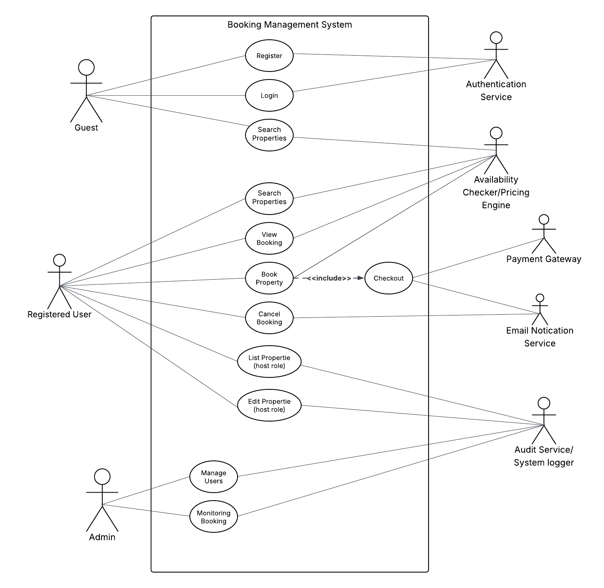

#  Requirement Analysis in Software Development

This repository serves as a comprehensive resource and a practical project for mastering the principles and methodologies of Requirement Analysis in the Software Development Life Cycle (SDLC). Through a series of structured tasks, it aims to provide a detailed blueprint for defining, documenting, analyzing, and structuring software requirements, simulating real-world development scenarios for effective project execution.

##  What is Requirement Analysis?

**Requirement Analysis** is a vital phase in the **Software Development Life Cycle (SDLC)** where the goals, expectations, and needs of stakeholders are identified, gathered, analyzed, and documented. It serves as the foundation for building a software system that fulfills the intended purpose.

During this process, business analysts, developers, designers, and stakeholders collaborate to clearly define what the software must do and the constraints it must operate under. This helps ensure alignment between the development team and the end-users.

### 📌 Importance in the Software Development Lifecycle (SDLC)

**Requirement Analysis** is arguably one of the most vital stages in the SDLC for several reasons:

- **🧱 Foundation for Success:**  
  It lays the groundwork for the entire project. Just like building a house, a strong and accurate foundation (requirements) is essential to prevent structural problems later.

- **💸 Minimizes Risk and Cost:**  
  Identifying and addressing ambiguities, inconsistencies, and unfeasible requirements early in the process significantly reduces the likelihood of costly rework, delays, and project failures in later development stages. Changing a requirement during coding or testing is far more expensive than clarifying it during analysis.

- **🎯 Ensures Alignment:**  
  It guarantees that the developed software aligns perfectly with the actual business objectives and user expectations. This leads to a product that truly solves the problem it was intended for, increasing user satisfaction and business value.

- **📏 Defines Scope Clearly:**  
  A thorough analysis helps in defining the project's scope precisely, setting clear boundaries on what will and will not be delivered. This is crucial for managing stakeholder expectations and preventing *scope creep* – the uncontrolled expansion of project requirements.

- **📊 Aids in Planning and Estimation:**  
  With clear requirements, project managers can make more accurate estimates for timelines, resources, and budget, leading to more realistic and achievable project plans.

- **🗣️ Improves Communication:**  
  The process encourages continuous communication and collaboration among all stakeholders, fostering a shared understanding and reducing misunderstandings throughout the project.

- **✅ Basis for Testing and Validation:**  
  Well-defined requirements provide measurable criteria against which the final software product can be tested and validated, ensuring that it meets all specified functionalities and quality standards.

## Why is Requirement Analysis Important?

Requirement Analysis is a foundational phase in the Software Development Life Cycle (SDLC). Its importance cannot be overstated, as it directly impacts the success, cost, and quality of the final product. Below are three key reasons why it is critical:

### 1. ✅ Clear Project Scope and Alignment
Requirement Analysis ensures that the software development team and stakeholders have a **shared understanding** of what the system should do. This minimizes ambiguities and aligns the project with **business goals** and **user expectations**, preventing miscommunication and scope creep.

### 2. 💸 Cost and Time Efficiency
Identifying requirements early helps catch inconsistencies, conflicts, or unfeasible demands before development begins. Fixing issues during coding or testing is **much more expensive** than resolving them at the analysis stage. Effective requirement analysis reduces **rework**, **delays**, and overall **project costs**.

### 3. 🛠️ Foundation for Design, Development, and Testing
Well-defined requirements act as a **blueprint** for all future stages of the SDLC — from design to testing. They guide developers in building the right solution and enable testers to validate that the product meets its objectives through **clear acceptance criteria**.

> “A software project is only as strong as the requirements it is built on.”

## Key Activities in Requirement Analysis

Requirement Analysis involves several crucial activities that ensure the project's requirements are well understood and clearly defined:

- **Requirement Gathering**  
  Collecting raw information from stakeholders through interviews, surveys, workshops, observations, and document reviews to understand their needs and expectations.

- **Requirement Elicitation**  
  Refining and exploring the gathered information by brainstorming, focus groups, prototyping, and discussions to uncover detailed and precise requirements.

- **Requirement Documentation**  
  Recording the requirements in a clear, organized format such as Software Requirements Specifications (SRS), user stories, or use case documents to serve as a reference for all project members.

- **Requirement Analysis and Modeling**  
  Examining the documented requirements for consistency, feasibility, and completeness. Creating models like data flow diagrams, entity-relationship diagrams, or use case diagrams to visualize and validate the requirements.

- **Requirement Validation**  
  Reviewing the documented requirements with stakeholders to confirm accuracy and completeness. Defining acceptance criteria and ensuring all requirements align with project goals and stakeholder expectations.

## Types of Requirements

Requirements in software development can generally be categorized into two main types: Functional Requirements and Non-functional Requirements. Both are essential for defining a complete and successful software product.

### Functional Requirements ⚙️

**Definition:** Functional Requirements describe what the system should do. They specify the features and functionalities that the software must provide to its users to satisfy business needs. These are typically expressed as actions the system will perform under specific conditions.

**Examples for a Booking Management System:**

- **User Registration and Authentication:**  
  The system must allow new users to create an account with a unique email and password. Registered users must be able to log in securely, and the system should authenticate their credentials.

- **Search and Filter Bookings:**  
  Users must be able to search for available bookings (e.g., rooms, appointments, vehicles) based on various criteria such as date, time, location, price range, and type of service/item.

- **Book an Item/Service:**  
  Users must be able to select an available item/service, choose desired dates/times, review booking details, and confirm their reservation.

- **Manage Bookings:**  
  Registered users must be able to view their past and upcoming bookings, modify existing bookings (e.g., change dates, cancel), and receive confirmation of changes via email.

- **Admin Management of Listings:**  
  Administrators must be able to add new items/services, update their details (e.g., availability, price, description), and remove listings from the system.

- **Payment Processing:**  
  The system must integrate with a payment gateway to securely process payments for bookings.

### Non-functional Requirements 🛡️

**Definition:** Non-functional Requirements describe how the system should perform. They specify the quality attributes, characteristics, and constraints of the software rather than its specific behaviors. These requirements are crucial for the user experience and overall system effectiveness.

**Examples for a Booking Management System:**

- **Performance:**  
  - The system should load booking search results within 2 seconds for up to 1,000 concurrent users.  
  - Booking confirmation emails should be sent within 30 seconds of a successful booking.

- **Security:**  
  - All sensitive user data (e.g., passwords, payment information) must be encrypted both in transit and at rest.  
  - The system must protect against common web vulnerabilities such as SQL injection and cross-site scripting (XSS).  
  - User authentication must include strong password policies and support multi-factor authentication (MFA).

- **Scalability:**  
  - The system should be able to support a 50% increase in daily active users and booking volume year-over-year without significant degradation in performance.  
  - The architecture should allow for horizontal scaling of web servers and database instances.

- **Usability:**  
  - The booking interface must be intuitive, allowing a first-time user to complete a booking within 3 minutes.  
  - Error messages must be clear, concise, and provide actionable guidance to the user.  
  - The system must be fully responsive and accessible across various devices (desktop, tablet, mobile).

- **Reliability:**  
  - The system must achieve an uptime of 99.9% annually, excluding scheduled maintenance.  
  - In the event of a system failure, data recovery must be possible within 1 hour with minimal data loss.

- **Maintainability:**  
  - The codebase should adhere to established coding standards and be well-documented to allow new developers to understand and modify it efficiently.  
  - Patches and minor updates should be deployable without significant system downtime.

## Use Case Diagrams

### What is a Use Case Diagram?

A **Use Case Diagram** is a visual representation that shows the interactions between users (actors) and the system to achieve specific goals (use cases). These diagrams help capture the system's functional requirements from an end-user perspective and depict how users interact with various parts of the system.

### Benefits of Use Case Diagrams

- ✅ **Clarifies system functionality** by focusing on what the system does rather than how.
- 🧩 **Improves communication** among stakeholders, developers, and designers.
- 🔍 **Identifies system boundaries** and highlights user roles.
- 📄 **Serves as a planning tool** to validate and prioritize features.

### 📌 Use Case Diagram for the Booking Management System

The diagram below illustrates the key actors and their interactions with the booking management system.

### Actors Overview

#### Primary Actors
- **Guest**: Can register, log in, and search properties.
- **Registered User**: Can search, book, view/cancel bookings, and (as host) list or edit properties.
- **Admin**: Can manage users and monitor system data.

#### Secondary Actors
- **Authentication Service**: Handles login and registration validation.
- **Database**: Persists all application data.
- **Email Notification Service**: Sends emails for confirmations and alerts.
- **Payment Gateway**: Processes booking payments securely.
- **System Logger**: Tracks system activities and admin actions for auditing.
- **Availability & Pricing Service**: Handles availability checks and dynamic pricing (if used).

